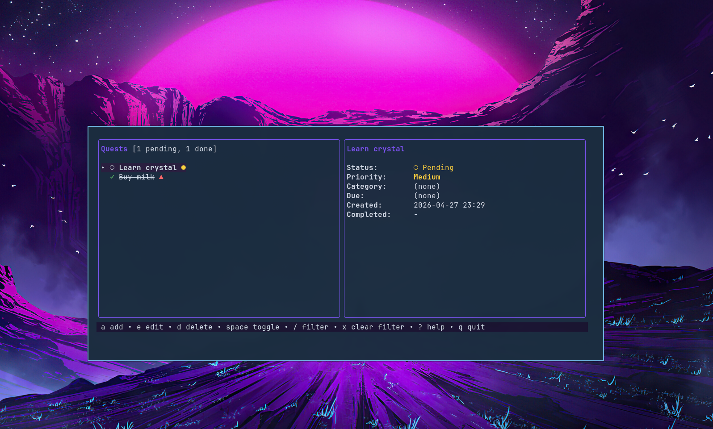
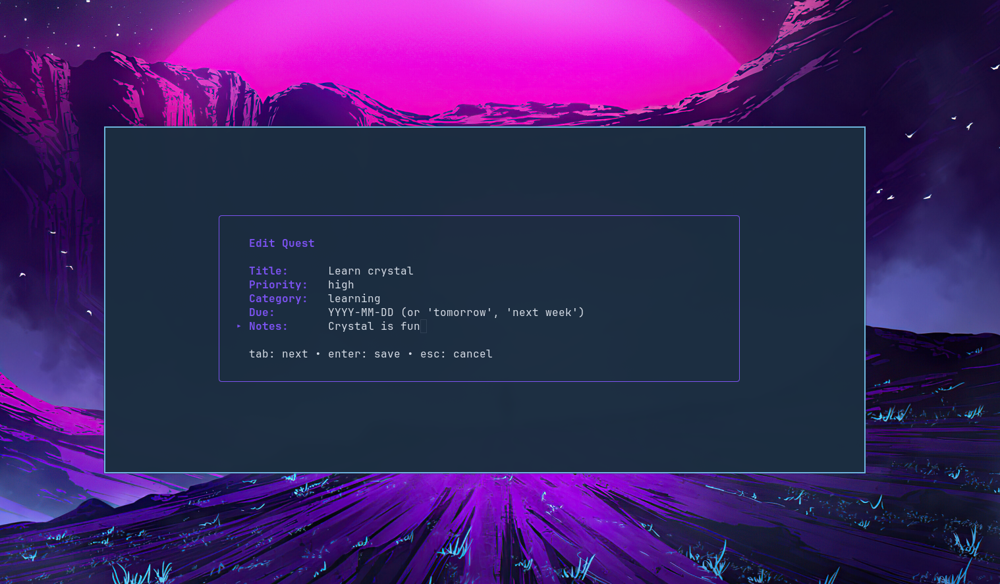

# quests.cr

A simple terminal todo app with waybar integration.

Built with [Crystal](https://crystal-lang.org) and [crubbletea](https://github.com/baltavay/crubbletea).

## Screenshots




## Features

- Add, edit, delete, and complete tasks
- Priority levels (high / medium / low)
- Categories, due dates, notes
- Filter/search tasks
- Vim-like keybindings (j/k, g/G, PgUp/PgDn)
- Waybar module showing pending count with overdue/today alerts
- Desktop notifications for overdue and due-today tasks

## Install

```
shards build
```

Binary goes to `bin/quests`. Put it somewhere in your `$PATH`.

## Usage

```
quests                         Launch TUI
quests add "Buy milk"          Quick add
quests done 3                  Toggle done by id
quests list                    Print tasks to terminal
quests --waybar                Waybar JSON output
quests --notify                Desktop notification
quests --count                 Print pending count
```

### Keybindings

| Key     | Action          |
|---------|-----------------|
| a       | Add quest       |
| e       | Edit quest      |
| d       | Delete quest    |
| space   | Toggle done     |
| /       | Filter          |
| x       | Clear filter    |
| ?       | Help            |
| q       | Quit            |

## Waybar

Add to your waybar config:

```json
"custom/quests": {
  "exec": "quests --waybar --notify",
  "return-type": "json",
  "interval": 60
}
```

This way waybar updates the pending count every 60 seconds and also sends a desktop notification about overdue and due-today tasks. Annoying by design.

Classes: `done`, `overdue`, `today`, `normal`. Use them to style the module.

## Data

Tasks are stored in `~/.local/share/quests/data.json`.

## License

MIT
