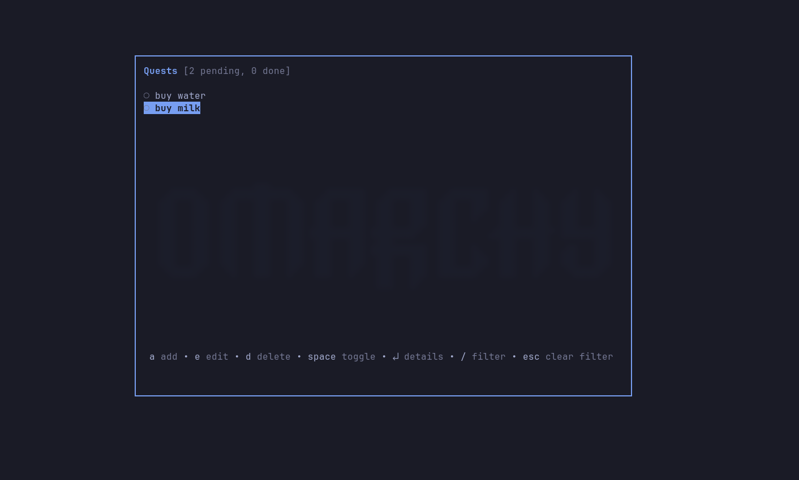
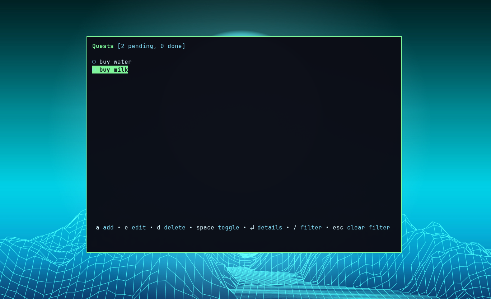
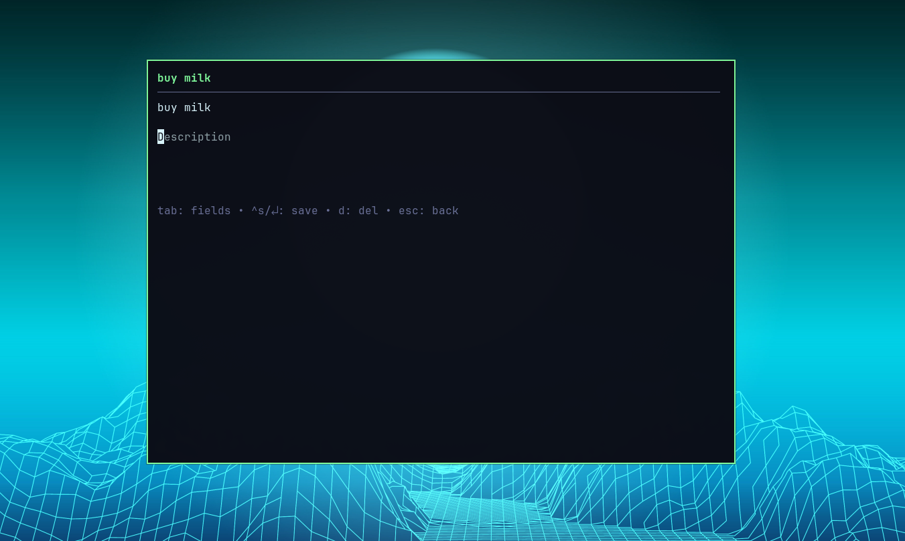
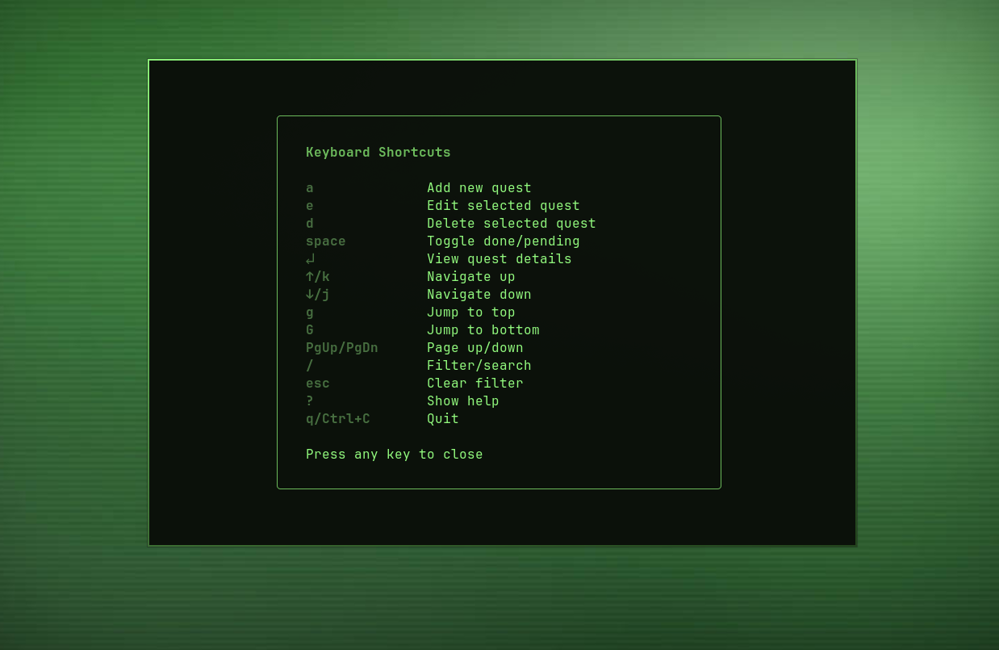

# quests.cr

Terminal todo app for [Omarchy](https://omarchy.org/). Built with [Crystal](https://crystal-lang.org) and [crubbletea](https://github.com/baltavay/crubbletea).






## Usage

```
quests                         Launch TUI
quests add "Buy milk"          Quick add
quests done 3                  Toggle done by id
quests list                    Print tasks to terminal
quests --waybar                Waybar JSON output
quests --count                 Print pending count
```

### Keybindings

| Key   | Action          |
|-------|-----------------|
| a     | Add quest       |
| e     | Edit quest      |
| d     | Delete quest    |
| enter | View details    |
| space | Toggle done     |
| /     | Filter          |
| ?     | Help            |
| q     | Quit            |

## Waybar

```json
"custom/quests": {
  "exec": "/path/to/bin/quests --waybar",
  "return-type": "json",
  "format": "{}",
  "on-click": "omarchy-launch-floating-terminal-with-presentation /path/to/bin/quests",
  "interval": 30
}
```

## Build

```
make          # shards build --release
make clean    # remove binary
```

Binary at `bin/quests`. Data stored in `~/.local/share/quests/data.json`.
